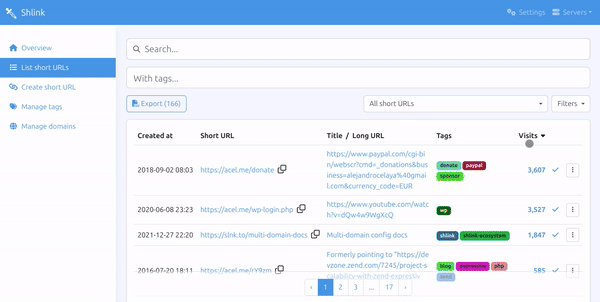

# shlink-web-client

[](https://github.com/shlinkio/shlink-web-client/actions?query=workflow%3A%22Continuous+integration%22)
[](https://app.codecov.io/gh/shlinkio/shlink-web-client)
[](https://github.com/shlinkio/shlink-web-client/releases/latest)
[](https://hub.docker.com/r/shlinkio/shlink-web-client/)
[](https://github.com/shlinkio/shlink-web-client/blob/main/LICENSE)
[](https://slnk.to/donate)

A ReactJS-based progressive web application for [Shlink](https://shlink.io).



> If you are trying to find out how to run the project in development mode or how to provide contributions, read the [CONTRIBUTING](CONTRIBUTING.md) doc.

## Installation

There are three ways in which you can use this application.

### From app.shlink.io

The easiest way to use shlink-web-client is by just going to <https://app.shlink.io>.

The application runs 100% in the browser, so you can safely access any shlink instance from there.

### Docker image

If you want to deploy shlink-web-client in a container-based cluster (kubernetes, docker swarm, etc), just pick the [shlinkio/shlink-web-client](https://hub.docker.com/r/shlinkio/shlink-web-client/) image and do it.

It's a lightweight [nginx:alpine](https://hub.docker.com/r/library/nginx/) image serving the static app on port 80.

### Self-hosted

If you want to self-host it yourself, get the [latest release](https://github.com/shlinkio/shlink-web-client/releases/latest) and download the distributable zip file attached to it (`shlink-web-client_X.X.X_dist.zip`).

The package contains static files only, so just put it in a folder and serve it with the web server of your choice.

**Considerations**:

* Provided dist files are configured to be served from the root of your domain. If you need to serve shlink-web-client from a subpath, you will have to build it yourself following [these steps](#serve-shlink-in-subpath).
* The app has a client-side router that handles dynamic paths. Because of that, you need to configure your web server to fall-back to the `index.html` file when requested files do not exist.
    * If you use Apache, you are covered, since the project includes an `.htaccess` file which already does this.
    * If you use nginx, you can [see how it's done](config/docker/nginx.conf) for the docker image and do the same.

## Pre-configuring servers

The first time you access shlink-web-client from a browser, you will have to configure the list of shlink servers you want to manage, and they will be saved in the local storage.

Those servers can be exported and imported in other browsers, but if for some reason you need some servers to be there from the beginning, starting with shlink-web-client 2.1.0, you can provide a `servers.json` file in the project root folder (the same containing the `index.html`, `favicon.ico`, etc) with a structure like this:

```json
[
  {
    "name": "Main server",
    "url": "https://doma.in",
    "apiKey": "09c972b7-506b-49f1-a19a-d729e22e599c"
  },
  {
    "name": "Local",
    "url": "http://localhost:8080",
    "apiKey": "580d0b42-4dea-419a-96bf-6c876b901451"
  }
]
```

> The list can contain as many servers as you need.

If you are using the shlink-web-client docker image, you can mount the `servers.json` file in a volume inside `/usr/share/nginx/html`, which is the app's document root inside the container.

    docker run --name shlink-web-client -p 8000:80 -v ${PWD}/servers.json:/usr/share/nginx/html/servers.json shlinkio/shlink-web-client

> **Be extremely careful when using this feature.**
>
> Due to shlink-web-client's client-side nature, the file needs to be accessible from the browser.
>
> Because of that, make sure you use this only when you self-host shlink-web-client, and you know only trusted people will have access to it.
>
> Failing to do this could cause your API keys to end up being exposed.

## Serve project in subpath

Official distributable files have been built so that they are served from the root of a domain.

If you need to host shlink-web-client yourself and serve it from a subpath, follow these steps:

* Download shlink-web-client source code for the version you want to build.
    * For example, if you want to build `v1.0.1`, use this link https://github.com/shlinkio/shlink-web-client/archive/v1.0.1.zip
    * Replace the `v1.0.1` part in the link with the one of the version you want to build.
* Decompress the file and `cd` into the resulting folder.
* Open the `package.json` file in the root of the project, locate the `homepage` property and replace the value (which should be an empty string) by the path from which you want to serve shlink-web-client.
    * For example: `"homepage": "/my-projects/shlink-web-client",`.
* Build the project:
    * For classic hosting:
        * Download [node](https://nodejs.org/en/download/package-manager/) 10.15 or later.
        * Install project dependencies by running `npm install`.
        * Build the project by running `npm run build`.
        * Once the command finishes, you will have a `build` folder with all the static assets you need to run shlink-web-client. Just place them wherever you want them to be served from.
    * For docker image:
        * Download [docker](https://docs.docker.com/install/).
        * Build the docker image by running `docker build . -t shlink-web-client`.
        * Once the command finishes, you will have an image with the name `shlink-web-client`.
